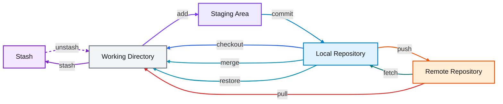
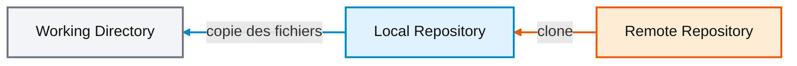
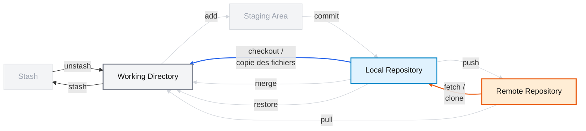
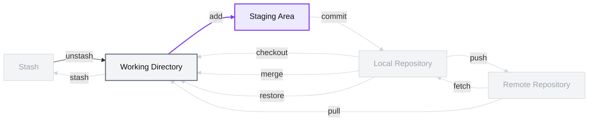
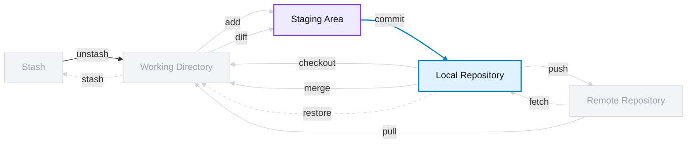
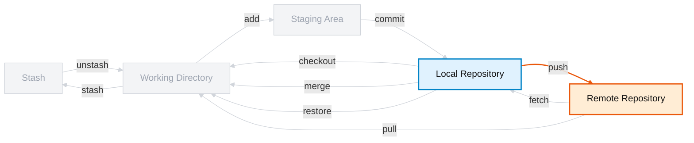
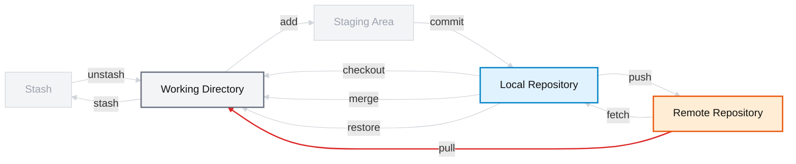
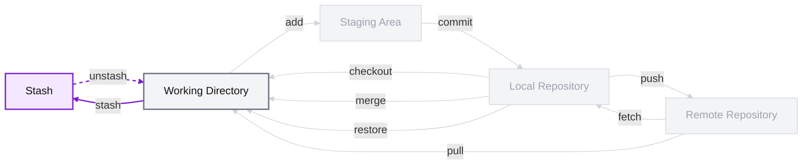
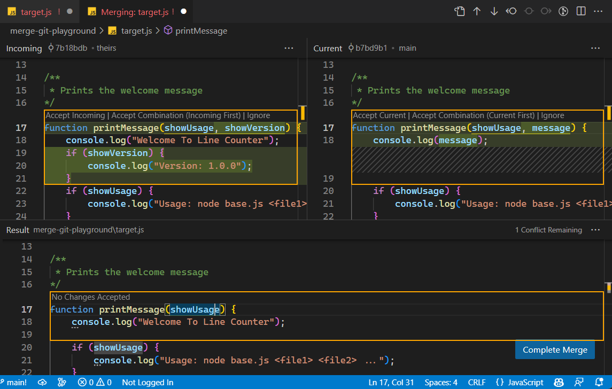

Salut!

# Introduction

Le document qui suit est une version écrite de l'atelier d'introduction que j'ai ([Iannick Gagnon](https://www.linkedin.com/in/iannick-gagnon-3304311a6/)) animé lors de l'événement SageDays 2026 tenu à l'ÉTS les 27-28-29 du mois d'avril 2026.

Pour me rejoindre: [iannick.gagnon@etsmtl.ca](mailto:iannick.gagnon@etsmtl.ca)

# Vue d’ensemble du flux de travail Git

Cet atelier s'oriente autour du flux de travail Git illustré dans le diagramme ci-dessous.

---

## Diagramme



---

## 1 - Que représentent les rectangles ?

Le diagramme est organisé autour de cinq régions, chacune représentant **un endroit où les changements peuvent exister à un moment donné** dans Git.

| Rectangle | Description |
|---|---|
| `Stash` | Zone **temporaire** où Git peut mettre de côté des modifications non terminées pour les récupérer plus tard. |
| `Working Directory` | Fichiers tels qu’ils existent actuellement sur le disque (**navigateur de projet de votre IDE**). |
| `Staging Area` | Zone **intermédiaire** où l’on prépare précisément ce qui fera partie du prochain `git commit`. |
| `Local Repository` | Contient **l’historique Git enregistré localement sur la machine**, notamment les commits et les branches locales. |
| `Remote Repository` | Dépôt distant, par exemple sur **GitHub**, qui permet de partager et de synchroniser le projet. |

---

## 2 - Git != GitHub

Il est commun de confondre **Git** et **GitHub**, mais ce sont deux choses différentes.

**Git est un logiciel** de gestion de versions ou *version control system* (VCS) qui s'installe sur votre machine.
C'est lui qui permet de suivre l'historique d'un projet, de créer des commits, de gérer des branches, etc.

**GitHub est un service d'hébergement distant muni d'une interface web**. Dans le diagramme ci-dessus, il correspond uniquement a la région `Remote Repository`. Il sert a partager et à synchroniser le projet, notamment dans le cadre d'un travail collaboratif.

GitHub est très populaire, mais ce n'est **pas la seule option**. Il existe plusieurs alternatives, par exemple :
- **GitLab** ([https://about.gitlab.com/](https://about.gitlab.com/))
- **Bitbucket** ([https://bitbucket.org/product/](https://bitbucket.org/product/))
- **l'auto-hébergement** sur un serveur que l'on contrôle soi-même ([https://about.gitea.com/](https://about.gitea.com/))

En résumé:
- **Git** = l'outil
- **GitHub** = un service en ligne qui peut héberger un dépôt Git

---

## 3 - Installation

Git doit être installé sur votre machine pour pouvoir être utilisé en ligne de commande. L'installation dépend du système d'exploitation. **Il est généralement préinstallé sur macOs et Linux (`git --version`)**.

S'il n'est pas installé, suivez les instructions spécifiques à votre OS ici: [https://git-scm.com/install/](https://git-scm.com/install/).

### 3.1 - Vérification

Une fois l'installation terminée, vérifiez que Git est disponible avec la commande suivante (votre résultat pourrait être différent) :

```
> git --version
git version 2.46.2.windows.1
```

### 3.2 - Configuration initiale

Il est fortement recommandé de configurer son nom et son adresse courriel avant de commencer à faire des commits :

```bash
git config --global user.name "Votre Nom"
git config --global user.email "votre.email@example.com"
```

Vous pouvez utiliser un nom (`user.name`) de votre choix, mais assurez-vous qu'il vous identifie clairement, car personne n'aime travailler avec `MasterHacker1337`. Sinon, il est important d'utiliser le même courriel (`user.email`) qui est associé a votre compte GitHub, afin que vos commits soient correctement reliés à votre profil ([exemple](https://github.com/iannickgagnon)).

---

## 5 - Premiers pas

Cette partie se concentre sur la dernière région, soit le `Remote Repository`, puisque cela nous permettra de visualiser le flux de travail Git à travers l'interface web de GitHub.

Nous allons:
1. Créer un dépôt distant ([lien](https://docs.github.com/fr/enterprise-cloud@latest/repositories/creating-and-managing-repositories/quickstart-for-repositories)).
2. Créer un fichier nommé `README.md` et y insérer du contenu à partir de l'interface web de GitHub
3. En faire une copie locale dans `Local Repository` (`git clone`)
4. Le modifier dans le `Working Directory`
5. Le déplacer vers le `Staging Area` (`git add`)
6. L'enregistrer dans le `Local Repository` (`git commit`)
7. L'enregistrer dans le `Remote Repository` (`git push`)
8. Modifier README.md à partir de l'interface web de GitHub
9. Charger les mises à jour depuis le dépôt distant (`git pull`)

> [!IMPORTANT]
> Réalisez les étapes 1 et 2 avant de continuer.

### 5.1 - Étape 3: Cloner un dépôt distant

> [!NOTE]
> **Définition.** Cloner un dépôt consiste à créer une copie locale d'un dépôt distant (`Working Directory` ⟵ `Local Repository` ⟵ `Remote Repository`). Le `Local Repository` (`.git/`) contient des objets Git en binaire représentant l'historique du projet. Git utilise ensuite ces objets pour recréer les fichiers ordinaires du `Working Directory` (ex: `main.py`).

Voici une version simplifiée de l'opération:


Voici une version simplifiée du schéma d'origine:


La commande correspondante est la suivante (**référence:** [https://git-scm.com/docs/git-clone](https://git-scm.com/docs/git-clone)):
```markdown
git clone <url_du_depot> [nom_dossier]
```

L'`url_du_depot` est l'adresse menant à la racine de votre dépôt et ressemble généralement à `https://github.com/<votre_nom>/<nom_du_depot>` (avec ou sans `.git` à la fin). Le nom du dossier (`nom_dossier`) correspond au nom du dossier **local** qui contiendra le dépôt cloné.

Après cette opération, l'état actuel est le suivant :
1. Le `Stash` est vide.
2. Le `Working Directory` contient les fichiers clonés.
3. Le `Staging Area` est "vide" (c'est-à-dire déjà à jour avec le `Local Repository`).
4. Les données du `Local Repository` sont stockées dans un dossier caché nommé `.git/`.

> [!IMPORTANT]
> Ouvrez `README.md`, modifiez-le, puis sauvegardez. Passez ensuite à la prochaine étape.

### 5.2 - Étape 5: Déplacer vers le `Staging Area`



> [!NOTE]
> **Définition.** Déplacer des modifications vers le `Staging Area` consiste à indiquer à Git quels changements du `Working Directory` doivent faire partie du prochain commit (`Working Directory` ⟶ `Staging Area`).

La commande correspondante est la suivante (**référence:** [https://git-scm.com/docs/git-add](https://git-scm.com/docs/git-add)):
```markdown
git add <fichier_ou_dossier>
```

Le paramètre `fichier_ou_dossier` désigne l'élément dont on souhaite préparer les modifications. Il peut s'agir d'un fichier précis, d'un dossier, ou encore de `.` pour désigner le dossier courant.

> [!IMPORTANT]
> Avant d'exécuter `git add`, exécutez `git status` pour constater que le fichier modifié n'a pas encore été ajouté au `Staging Area` avec la mention `Changes not staged for commit`. Exécutez-la aussi après pour voir qu'il est ajouté avec la mention `Changes to be committed`.

Par exemple, si vous avez modifié le fichier `README.md`, vous pouvez exécuter la commande suivante :
```markdown
git add README.md
```

Après cette opération, l'état actuel est le suivant :
1. Le `Stash` est vide.
2. Le `Working Directory` contient toujours les fichiers modifiés.
3. Le `Staging Area` contient maintenant une copie instantanée des modifications préparées pour le prochain commit.
4. Le `Local Repository` n'a pas encore été modifié.

### 5.3 - Étape 6: Enregistrer dans le `Local Repository`



> [!NOTE]
> **Définition.** Enregistrer des modifications dans le `Local Repository` consiste à créer un nouveau commit à partir du contenu actuel du `Staging Area` (`Staging Area` ⟶ `Local Repository`).

La commande correspondante est la suivante (**référence:** [https://git-scm.com/docs/git-commit](https://git-scm.com/docs/git-commit)):
```markdown
git commit -m "message du commit"
```

Le paramètre `message du commit` est une courte description des changements enregistrés. Ce message doit être suffisamment clair pour permettre de comprendre rapidement la nature du commit dans l'historique du projet.

Par exemple, si vous venez de préparer les modifications apportées à `README.md`, vous pouvez exécuter la commande suivante :
```markdown
git commit -m "Modifie README.md"
```

Après cette opération, l'état actuel est le suivant :
1. Le `Stash` est vide.
2. Le `Working Directory` est à nouveau "propre" si aucun autre changement n'a été effectué depuis le `git add`.
3. Le `Staging Area` est à jour avec le nouveau commit ou "vide".
4. Le `Local Repository` contient maintenant un nouveau point dans l'historique.

> [!IMPORTANT]
> Exécutez `git commit -m "docs: Modifie README.md"`, puis observez le résultat avec `git log --oneline`.

### 5.4 - Étape 7: Enregistrer dans le `Remote Repository`



> [!NOTE]
> **Définition.** Enregistrer des modifications dans le `Remote Repository` consiste à envoyer les commits du `Local Repository` vers le dépôt distant (`Local Repository` ⟶ `Remote Repository`).

La commande correspondante est la suivante (**référence:** [https://git-scm.com/docs/git-push](https://git-scm.com/docs/git-push)):
```markdown
git push -u origin main
```

Après cette opération, l'état actuel est le suivant :
1. Le `Stash` est vide.
2. Le `Working Directory` est propre si aucun autre changement n'a été effectué.
3. Le `Staging Area` est à jour avec le `Local Repository`.
4. Le `Local Repository` et le `Remote Repository` contiennent maintenant le même nouveau commit.

> [!IMPORTANT]
> Exécutez `git push -u origin main`, puis vérifiez sur GitHub que votre commit apparaît bien dans le dépôt distant.

### 5.5 - Étape 9: Charger les mises à jour depuis le dépôt distant (`git pull`)

> [!IMPORTANT]
> Réalisez l'étape 8 avant de continuer.



> [!NOTE]
> **Définition.** Charger les mises à jour depuis le dépôt distant consiste à récupérer les changements présents dans le `Remote Repository` et à les intégrer dans le `Working Directory`. Dans ce document, nous représentons cette opération de manière simplifiée par `Working Directory` ⟵ `Remote Repository`. **Vous pouvez considérer que `git pull` est un raccourci équivalent à `git fetch` suivi de `git merge`**.

La commande correspondante est la suivante (**référence:** [https://git-scm.com/docs/git-pull](https://git-scm.com/docs/git-pull)) :
```markdown
git pull
```

Dans le cas le plus simple, cette commande récupère les changements faits à distance et met à jour vos fichiers locaux pour refléter le nouvel état du projet.

> [!IMPORTANT]
> Dans les faits, `git pull` est une commande plus riche que cette représentation simplifiée. Elle combine essentiellement une récupération des changements distants et une intégration dans votre copie locale. Pour l'instant, nous retiendrons surtout son effet visible: vos fichiers locaux sont mis à jour.

Par exemple, si vous avez modifié `README.md` directement à partir de l'interface web de GitHub à l'étape 8, vous pouvez maintenant exécuter :
```markdown
git pull
```

Notez que cette commande est une version simplifiée de la suivants:
```markdown
git pull <remote> <branche>
```

Après cette opération, l'état actuel est le suivant :
1. Le `Stash` est vide.
2. **Le `Working Directory` contient maintenant la version mise à jour des fichiers.**
3. Le `Staging Area` est à jour avec le `Local Repository`.
4. **Le `Local Repository` a été mis à jour pour refléter les changements provenant du `Remote Repository`.**

> [!IMPORTANT]
> Exécutez `git pull`, puis ouvrez `README.md` pour vérifier que les modifications faites dans GitHub ont bien été récupérées localement.


## 6 - Introduction aux branches

La commande `git push -u origin main` de la section précédente envoie les commits de la **branche** locale `main` située dans le `Local Repository`) vers le dépôt distant nommé `origin` (c.-à-d. celui sur GitHub). Nous n'avons par encore précisé ce qu'est une branche.

> [!NOTE]
> **Définition.** Une branche est un nom donné a une ligne de développement. Elle permet de faire des commits sans modifier directement une autre ligne de developpement, comme `main`.

<p align="center">
  
  <br>
</p>
<p align="center"><strong>Figure 1 - Schéma de branches simples</strong></p>

Dans la **Figure 1**, il y a deux branches: `main` et `dev`. La branche `main` est généralement créée par défaut. Dans d'anciens projets, on peut toutefois rencontrer `master`. La branche `dev` est une ligne de développement appart (p. ex. vous travaillez sur un *feature*) qui  contient les noeuds `A-B`, alors que la branche `main` contient les noeuds `A-C-D`. Meme si deux commits mènent a des fichiers semblables (p. ex. `B` et `D`), ils restent differents en Git dès que leurs historiques diffèrent.

Pour revenir à l'exemple de départ, nous avons :
- `origin` : Désigne le dépôt distant configuré automatiquement lors du `git clone`.
- `main` : Désigne la branche locale que l'on souhaite envoyer. Dans notre cas, il s'agit de `main`.
- `-u` : Établit un lien de suivi entre la branche locale et la branche distante correspondante (la prochaine fois,  nous pouvons simplement faire `git push`).

> [!NOTE]
> Le terme `origin` est parfois agaçant au début, mais il n'est rien de plus qu'un surnom choisi par Git, un peu comme le nom d'une variable. Il permet de référencer plus facilement l'adresse complète du dépôt distant. D'ailleurs, vous pouvez remplacer `origin` par l'adresse complète, mais c'est plutôt verbeux et vous comprendrez rapidement pourquoi un alias est utile.

Cela dit, il est important de savoir que cette commande est un raccourci pour la suivante : `git push origin main:main`. La voici dans sa forme générale : 
```markdown
git push origin <source_locale>:<destination_distante>
```
Autrement dit, nous faisons un `push` des commits de la branche locale `main` vers la branchge `main` du dépôt distant `origin`.

## 7 - Mise en oeuvre des branches

Dans cette section, nous allons:
1. Créer une branche nommée `dev` et s'y déplacer (`git checkout`).
2. Créer un nouveau fichier qui contient du code nommé `main.py`
3. Le déplacer dans le `Staging Area` (`git add`)
4. L'enregistrer dans le `Local Repository` (`git commit`)
5. L'enregistrer dans le `Remote Repository` (`git push`)
6. Fusionner la branche `dev` avec la branche `main` (`git merge`).

### 7.1 - Étape 1 : Créer une branche `dev` et s'y déplacer

> [!NOTE]
> **Définition.** Créer une branche consiste à ajouter un nouveau nom de branche dans le `Local Repository`, généralement à partir du commit courant. Se déplacer sur cette branche consiste ensuite à faire en sorte que le `Working Directory` reflète l'état de cette branche.

La commande correspondante est la suivante (**référence :** [https://git-scm.com/docs/git-checkout](https://git-scm.com/docs/git-checkout)) :
```markdown
git checkout -b dev
```

Cette commande effectue deux opérations à la fois :
1. Elle crée une nouvelle branche **locale** nommée `dev`;
2. Elle vous déplace immédiatement sur cette branche.

Vous pouvez observer le résultat comme suit:
```bash
> git branch
* main # ⟵ vous êtes sur la branche 'main' 
> git checkout -b dev
> git branch
* dev # ⟵ vous êtes maintenant sur la branche 'dev'
  main
```

Autrement dit, au lieu de rester sur `main`, vous commencez maintenant à travailler sur une ligne de développement distincte nommée `dev`.

Après cette opération, l'état actuel est le suivant :
1. Le `Stash` est vide.
2. Le `Working Directory` contient les mêmes fichiers qu'avant, puisque la branche `dev` vient d'être créée à partir du commit courant.
3. Le `Staging Area` est inchangé.
4. **Le `Local Repository` contient maintenant deux branches : `main` et `dev`.**
5. **La branche courante est maintenant `dev`.**

> [!IMPORTANT]
> Réalisez les étapes 2, 3 et 4 avant de continuer.

### 7.2 - Étape 5 : L'enregistrer dans le `Remote Repository`

La commande correspondante est la suivante (**référence :** [https://git-scm.com/docs/git-push](https://git-scm.com/docs/git-push)) :
```markdown
git push -u origin dev
```

Cette commande effectue ici trois opérations importantes plutôt que deux comme dans l'exemple précédent :
1. Elle crée une nouvelle branche `dev` sur le dépôt distant si elle n'existe pas encore.
2. Elle envoie les commits de la branche locale `dev` vers le dépôt distant `origin`.
3. Elle établit un lien de suivi entre la branche locale `dev` et la branche distante `dev`.

Vous pouvez observer le résultat comme suit :
```markdown
git push -u origin dev
git branch -v
```

L'option `-v` veut dire "verbeux" et affiche les commits les plus récents sur chacune des branches ainsi que leurs messages. L'option `-vv` veut dire *very verbose* ou "très verbeux" et affiche encore plus d'information.

### 7.3 - Étape 6 : Fusionner la branche `dev` avec la branche `main`

> [!NOTE]
 > **Définition.** Fusionner une branche consiste à **intégrer dans la branche courante** les commits provenant d'une autre branche. Ici, il s'agit d'intégrer le travail de `dev` dans `main`.

La commande correspondante est la suivante (**référence :** [https://git-scm.com/docs/git-merge](https://git-scm.com/docs/git-merge)) :
```markdown
git merge <autre_branche>
```

**Cette commande doit être exécutée après s'être déplacé sur la branche qui "reçoit" le `merge`**, soit `main`. Autrement dit, il faut d'abord faire :
```markdown
git checkout main
git merge dev
```

La première commande vous replace sur la branche `main`. La seconde demande à Git d'y intégrer les commits de la branche `dev`.

Si aucun conflit n'est présent, Git effectue alors la fusion automatiquement. Deux cas sont possibles :
- **Cas 2 :** Les branches `main` et `dev` ont toutes deux changé; Git crée alors un nouveau commit pour réunir les deux lignes de développement (**Figure 1**).
- **Cas 1 :** La branche `main` n'a pas changé depuis la création de `dev`; Git peut alors simplement faire avancer `main` jusqu'au dernier commit de `dev` (**Figure 2**).

<p align="center">
  
  <br>
</p>
<p align="center"><strong>Figure 2 - Déplacement de <em>main</em> vers <em>dev</em></strong></p>

> [!IMPORTANT]
> Le code de couleur utilisé dans les schémas peut donner l'impression qu'un commit "appartient" à une branche, mais ce n'est pas exact. **Une branche n'est pas un conteneur de commits**. C'est une *référence* vers un commit, habituellement le plus récent, et donc indirectement vers son historique.

Vous pouvez observer le résultat comme suit :
```markdown
git branch -v
git log --oneline --decorate --all
```

Après cette opération, l'état actuel est le suivant :
1. Le `Stash` est vide.
2. Le `Working Directory` est propre si aucun autre changement n'a été effectué.
3. Le `Staging Area` est à jour avec le `Local Repository`.
4. Le `Local Repository` contient maintenant une branche `main` qui inclut aussi le travail provenant de `dev`.
5. La branche `dev` existe encore, mais son contenu est maintenant intégré dans `main`.

### 8 - Gestion de conflits

Il se peut que les changements faits sur `dev` et `main` entrent en conflit. Par exemple, dans la **Figure 1** (reproduite ci-dessous), les commits `B` et `C` peuvent s'appliquer tous les deux **aux mêmes lignes** de `README.md`. 

<p align="center">
  
  <br>
</p>
<p align="center"><strong>Figure 1 - Schéma de branches simples</strong></p>

Le contenu dans `main` pourrait être:
```markdown
Nous sommes sur la branche main!
```
Alors que dans `dev` nous avons:
```markdown
Nous somes sur la branche dev!
```

Dans cet état, si vous tentez de changer de branche (ex: `git checkout dev`), vous verrez le message suivant, indiquant qu'il y a un conflit entre la version locale de README.md et celle de la branche `dev`:
```markdown
error: Your local changes to the following files would be overwritten by checkout:
        README.md
Please commit your changes or stash them before you switch branches.
Aborting
```

Vous pouvez visualiser le ou les conflits avec la commande `git diff <source>..<cible>` qui vous montrera les changements qui sont dans `<cible>`, mais pas dans `<source>`:
```shell
> git diff main..dev
index abcdef0..1234567 100644
--- a/README.md
+++ b/README.md
@@ -1 +1 @@
-Nous sommes sur la branche main!
+Nous sommes sur la branche dev!
```
Dans un `git diff main..dev`, la version `a/...` correspond a `main`, tandis que la version `b/...` correspond a `dev`. Plus généralement, `a` designe la version de gauche et `b` la version de droite dans la comparaison.

Si vous n'êtes pas prêt(e) à enregistrer ces changements, vous pouvez les mettre de côté temporairement dans le `Stash`, vous permettant ainsi de changer de branche. Pour ajouter le c
```bash
> git stash -m "Sauvegarde temporaire"
Saved working directory and index state WIP on main: Sauvegarde temporaire
> git stash list
stash@{0}: On main: Sauvegarde temporaire
```



Pour faire passer le contenu de la dernière entrée, celle à la position 0 (`stash@{0}`), vous pouvez faire `git stash pop` directement ou `git stash pop stash@{0}` pour être plus précis. **Cette dernière vous permet de retirer une entrée ciblée du stash quand il y en a plusieurs**.

> [!NOTE]
> Si vous avez exécuté les commandes précédentes en lien avec le `Stash`, assurez-vous qu'elle est vide pour continuer.

> [!CAUTION]
> Personnellement, j'utilise le stash pour des **durées *très* courtes**, car sinon cela devient une sorte de cimetière alors que j'oublie de la vider.

Si vous tentez de faire `git merge` à partir de `main`, vous verrez un message semblable au suivant:
```markdown
Auto-merging README.md
CONFLICT (content): Merge conflict in README.md
Automatic merge failed; fix conflicts and then commit the result.
```

Si vous faites `git status`, vous verrez:
```markdown
Unmerged paths:
  (use "git add <file>..." to mark resolution)
        both modified:   README.md
```

En ouvrant `README.md`, **n'ayez as peur**, vous verrez:
```markdown
<<<<<<< HEAD
Nous sommes sur la branche main!
=======
Nous sommes sur la branche dev!
>>>>>>> dev
```

La ligne `<<<<<<< HEAD` correspond à la version courante (sur `main`) séparée de la version sur `dev` (`>>>>>>> dev`) par la ligne `=======`. Pour résoudre ce conflit manuellement, effacez ces lignes et conserver la version de votre choix. Par exemple:
```markdown
Nous sommes sur la branche main!
```

Vous devez ensuite faire `git add`, `git commit` et `git push` pour mettre la branche `main` distante à jour. Dans la **Figure 1**, cela correspond au **commit de merge** nommé `D`. La couleur mauve indique que `D` possède une origine mixte découlant d'une résolution de conflit.

Cette méthode fonctionne très bien, mais peut devenir lourde quand il y a plusieurs conflits. Dans ce cas, il est plus simple (et sécuritaire) d'utiliser l'interface d'un IDE comme VS Code qui contient des outils comme le suivant : 

<p align="center">
  
  <br>
</p>
<p align="center" ><strong>Figure 3 - Éditeur de conflits VS Code</strong></p>

Le lien suivant contient plus de détails : [cliquez ici](https://code.visualstudio.com/docs/sourcecontrol/merge-conflicts).

### 8 - Au secours!

Les choses étant ce qu'elles sont, vous arriverez certainement dans une situation dans laquelle vous voudrez revenir en arrière. Il existe plusieurs commandes pour réécrire l'historique telles que `git reset`, `git rebase`, mais nous aborderons la plus utile dans le cadre de notre première aventure: `git restore`.

> [!NOTE]
> **Définition.** La commande `git restore` permet de remettre un fichier dans un état antérieur connu de Git. Selon les options utilisées, elle peut agir sur le `Working Directory` ou sur le `Staging Area`.

Les deux formes présentées sont (**référence:** [https://git-scm.com/docs/git-pull](https://git-scm.com/docs/git-restore)) :

```markdown
git restore <fichier>
git restore --staged <fichier>
```

La commande `git restore <fichier>` annule les modifications locales présentes dans le `Working Directory` tandis que `git restore --staged <fichier>` retire un fichier du `Staging Area` sans effacer les modifications présentes dans le `Working Directory`.

### 9 - Références

Cette section contient quelques références utiles pour apprendre Git. Personnellement, quand j'apprends quelque chose de nouveau (ex: Terraform, Docker, regex, YAML, TOML, etc.) je commence toujours (lire: *très* souvent) par imprimer une feuille du style aide-mémoire (*cheat sheet*), je la plastifie et je l'applique plusieurs fois dans un contexte simulé pour faire un survol du sujet. C'est ce que vous trouverez à la **Référence 1** ci-dessous. Ensuite, je consulte la documentation technique des commandes de l'aide-mémoire pour comprendre plus en profondeur. C'est ce que vous trouverez à la **Référence 2**. Finalement, pour créer des automatismes, je cherche des versions gamifiées telles que présentées à la **Référence 3**. Vous seriez surpris de découvrir à quel point il existe de jeux éducatifs en informatique.

1. La feuille aide-mémoire préparée par GitHub: [cliquez ici](https://github.com/iannickgagnon/sagedays_iannick_2026/blob/main/git_1/assets/git_cheat_sheet.pdf).
2. Le livre Pro Git de Scott Chacon et Ben Straub gratuit sur le site officiel de Git : [cliquez ici](https://git-scm.com/book/fr/v2).
3. Tutoriels gamifiés:
    - [https://learngitbranching.js.org/?locale=fr_FR](https://learngitbranching.js.org/?locale=fr_FR)
    - [https://ohmygit.org/](https://ohmygit.org/)
    - [https://gitbybit.com/](https://gitbybit.com/)
 4. Guide d'hygiène pour les commits: [https://www.conventionalcommits.org/en/v1.0.0/](https://www.conventionalcommits.org/en/v1.0.0/)

Bon apprentisage!

---
Iannick Gagnon
