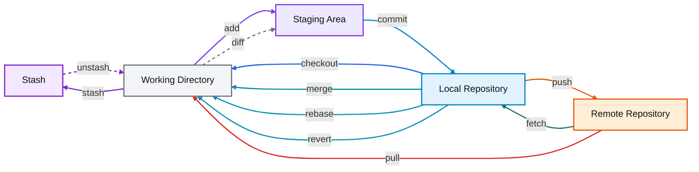
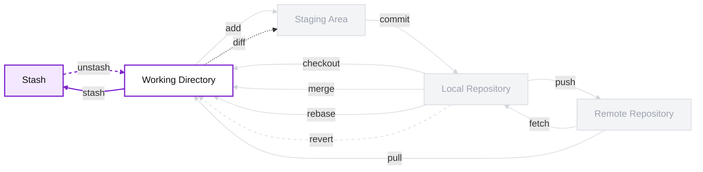

# Vue d’ensemble du flux de travail Git

Cet atelier s'oriente autour du flux de travail Git illustré dans le diagramme ci-dessous.

---

## Diagramme



---

## 1 - Que représentent les rectangles ?

Le diagramme est organisé autour de cinq régions, chacune représentant **un endroit où les changements peuvent exister à un moment donné** dans Git.

| Rectangle | Description |
|---|---|
| `Stash` | Zone **temporaire** où Git peut mettre de côté des modifications non terminées pour les récupérer plus tard. |
| `Working Directory` | Fichiers tels qu’ils existent actuellement sur le disque (**navigateur de projet de votre IDE**). |
| `Staging Area` | Zone **intermédiaire** où l’on prépare précisément ce qui fera partie du prochain `git commit`. |
| `Local Repository` | Contient **l’historique Git enregistré localement sur la machine**, notamment les commits et les branches locales. |
| `Remote Repository` | Dépôt distant, par exemple sur **GitHub**, qui permet de partager et de synchroniser le projet. |

---

## 2 - Git != GitHub

Il est commun de confondre **Git** et **GitHub**, mais ce sont deux choses différentes.

**Git est un logiciel** de gestion de versions ou *version control system* (VCS) qui s'installe sur votre machine.
C'est lui qui permet de suivre l'historique d'un projet, de créer des commits, de gérer des branches, etc.

**GitHub est un service d'hébergement distant muni d'une interface web**. Dans le diagramme ci-dessus, il correspond uniquement a la région `Remote Repository`. Il sert a partager et à synchroniser le projet, notamment dans le cadre d'un travail collaboratif.

GitHub est très populaire, mais ce n'est **pas la seule option**. Il existe plusieurs alternatives, par exemple :
- **GitLab** ([https://about.gitlab.com/](https://about.gitlab.com/))
- **Bitbucket** ([https://bitbucket.org/product/](https://bitbucket.org/product/))
- **l'auto-hébergement** sur un serveur que l'on contrôle soi-même ([https://about.gitea.com/](https://about.gitea.com/))

En résumé:
- **Git** = l'outil
- **GitHub** = un service en ligne qui peut héberger un dépôt Git

---

## 3 - Installation

Git doit être installé sur votre machine pour pouvoir être utilisé en ligne de commande. L'installation dépend du système d'exploitation. **Il est généralement préinstallé sur macOs et Linux (`git --version`)**.

S'il n'est pas installé, suivez les instructions spécifiques à votre OS ici: [https://git-scm.com/install/](https://git-scm.com/install/).

### 3.1 - Vérification

Une fois l'installation terminée, vérifiez que Git est disponible avec la commande suivante (votre résultat pourrait être différent) :

```
> git --version
git version 2.46.2.windows.1
```

### 3.2 - Configuration initiale

Il est fortement recommandé de configurer son nom et son adresse courriel avant de commencer à faire des commits :

```bash
git config --global user.name "Votre Nom"
git config --global user.email "votre.email@example.com"
```

Vous pouvez utiliser un nom (`user.name`) de votre choix, mais assurez-vous qu'il vous identifie clairement, car personne n'aime travailler avec `MasterHacker1337`. Sinon, il est important d'utiliser le même courriel (`user.email`) qui est associé a votre compte GitHub, afin que vos commits soient correctement reliés à votre profil ([exemple](https://github.com/iannickgagnon)).

---

## 5 - Premiers pas

Cette partie se concentre sur la dernière région, soit le `Remote Repository`, puisque cela nous permettra de visualiser le flux de travail Git à travers l'interface web de GitHub.

Nous allons:
1. Créer un dépôt distant ([lien](https://docs.github.com/fr/enterprise-cloud@latest/repositories/creating-and-managing-repositories/quickstart-for-repositories)).
2. Créer un fichier nommé `README.md` et y insérer du contenu à partir de l'interface web de GitHub
3. En faire une copie locale dans `Local Repository` (`git clone`)
4. Le modifier dans le `Working Directory`
5. Le déplacer vers le `Staging Area` (`git add`)
6. L'enregistrer dans le `Local Repository` (`git commit`)
7. L'enregistrer dans le `Remote Repository` (`git push`)

> [!IMPORTANT]
> Réalisez les étapes 1 et 2 avant de continuer.

### 5.1 - Étape 3: Cloner un dépôt distant

> [!NOTE]
> **Définition.** Cloner un dépôt consiste à créer une copie locale d'un dépôt distant (`Local Repository` ⟵ `Remote Repository`).

La commande correspondant est la suivante (**référence:** [https://git-scm.com/docs/git-clone](https://git-scm.com/docs/git-clone)):
```markdown
git clone <url_du_depot> [nom_dossier]
```

L'`url_du_depot` est l'adresse menant à la racine de votre dépôt et ressemble généralement à `https://github.com/<votre_nom>/<nom_du_depot>` (avec ou sans `.git` à la fin). Le nom du dossier (`nom_dossier`) correspond au nom du dossier **local** qui contiendra le dépôt cloné.

Après cette opération, l'état actuel est le suivant :
1. Le `Stash` est vide.
2. Le `Working Directory` contient les fichiers clonés.
3. Le `Staging Area` est "vide" (c'est-à-dire déjà à jour avec le `Local Repository`).
4. Les données du `Local Repository` sont stockées dans un dossier caché nommé `.git/`.

> [!IMPORTANT]
> Ouvrez `README.md`, modifiez-le, puis sauvegardez. Passez ensuite à la prochaine étape.

### 5.2 - Étape 5: Déplacer vers le `Staging Area`

> [!NOTE]
> **Définition.** Déplacer des modifications vers le `Staging Area` consiste à indiquer à Git quels changements du `Working Directory` doivent faire partie du prochain commit (`Working Directory` ⟶ `Staging Area`).

La commande correspondante est la suivante (**référence:** [https://git-scm.com/docs/git-add](https://git-scm.com/docs/git-add)):
```markdown
git add <fichier_ou_dossier>
```

Le paramètre `fichier_ou_dossier` désigne l'élément dont on souhaite préparer les modifications. Il peut s'agir d'un fichier précis, d'un dossier, ou encore de `.` pour désigner le dossier courant.

Par exemple, si vous avez modifié le fichier `README.md`, vous pouvez exécuter la commande suivante :
```markdown
git add README.md
```

Après cette opération, l'état actuel est le suivant :
1. Le `Stash` est vide.
2. Le `Working Directory` contient toujours les fichiers modifiés.
3. Le `Staging Area` contient maintenant une copie instantanée des modifications préparées pour le prochain commit.
4. Le `Local Repository` n'a pas encore été modifié.

## Légende

- 🟣 **Violet** : préparation ou mise de côté des changements (`add`, `stash`, `unstash`)
- 🔵 **Bleu** : enregistrement local (`commit`, `checkout`)
- 🟦 **Bleu-cyan** : intégration ou transformation de l’historique (`merge`, `rebase`, `revert`)
- 🟠 **Orange** : envoi vers le dépôt distant (`push`)
- 🟢 **Vert-bleuté** : récupération depuis le dépôt distant (`fetch`)
- 🔴 **Rouge** : mise à jour du répertoire de travail depuis le distant (`pull`)
- ⚪ **Gris pointillé** : comparaison (`diff`)

---

## Les zones du diagramme

## 🟣 Stash

Le **stash** est une zone temporaire où l’on peut mettre de côté des modifications non terminées sans créer de commit.

Cela est utile lorsque :

- on veut changer rapidement de tâche ;
- on veut récupérer ou intégrer autre chose avant de continuer ;
- on ne veut pas encore enregistrer officiellement son travail dans l’historique Git.

### Diagramme ciblé



### Commandes utiles

```bash
git stash
git stash apply
git stash pop
```

### Idée à retenir

- `git stash` enlève temporairement des modifications du **working directory** et les met dans le **stash** ;
- `git stash apply` les remet dans le working directory ;
- `git stash pop` les remet aussi, puis retire l’entrée du stash.

### Exemple

```bash
git stash
git pull
git stash pop
```

Dans cet exemple :

1. on met les changements locaux de côté ;
2. on met à jour le projet ;
3. on réapplique les changements mis en attente.

---

### ⬜ Working Directory

Le **working directory** correspond aux fichiers tels qu’ils existent actuellement sur le disque.  
C’est l’espace dans lequel on modifie réellement le code, la documentation ou les ressources du projet.

C’est généralement le point de départ de la plupart des actions Git :

- on modifie des fichiers ;
- on les compare ;
- on les ajoute à l’index ;
- on peut aussi les mettre temporairement dans le stash.

---

### 🟣 Staging Area

La **staging area** (ou **index**) sert à préparer le prochain commit.

Elle permet de choisir précisément ce qui sera enregistré dans l’historique local.  
Autrement dit, elle agit comme une zone intermédiaire entre les fichiers modifiés et le commit final.

---

### 🟦 Local Repository

Le **local repository** contient l’historique Git enregistré localement sur la machine.

C’est là que se trouvent :

- les commits ;
- les branches locales ;
- l’état versionné du projet connu localement.

---

### 🟧 Remote Repository

Le **remote repository** est le dépôt distant, par exemple sur GitHub.

Il sert à :

- partager le projet avec d’autres personnes ;
- centraliser l’historique ;
- synchroniser le travail entre plusieurs machines ou plusieurs collaborateurs.

---

## 🟣 Ajouter des changements : `add`

### Commande
```bash
git add <fichier>
```

### Rôle
La commande `add` prend des modifications présentes dans le **working directory** et les place dans la **staging area**.

### Idée à retenir
On ne commit pas directement depuis les fichiers modifiés.  
On commence par sélectionner ce que l’on veut inclure dans le prochain commit.

### Exemple
```bash
git add README.md
```

---

## 🔵 Enregistrer dans l’historique local : `commit`

### Commande
```bash
git commit -m "Mon message"
```

### Rôle
La commande `commit` prend ce qui se trouve dans la **staging area** et l’enregistre dans le **local repository**.

### Idée à retenir
Le commit crée un point d’historique local contenant un état précis du projet.

### Exemple
```bash
git commit -m "Ajout d'une explication du workflow Git"
```

---

## 🟠 Envoyer vers le dépôt distant : `push`

### Commande
```bash
git push
```

### Rôle
La commande `push` envoie les commits du **local repository** vers le **remote repository**.

### Idée à retenir
Tant qu’on n’a pas fait `push`, les commits restent seulement sur la machine locale.

---

## 🟢 Récupérer depuis le distant : `fetch`

### Commande
```bash
git fetch
```

### Rôle
La commande `fetch` récupère les nouvelles informations du **remote repository** vers le **local repository**, sans modifier directement les fichiers du working directory.

### Idée à retenir
`fetch` met à jour ce que Git sait du dépôt distant, mais ne fusionne pas automatiquement ces changements dans les fichiers de travail.

---

## 🔴 Mettre à jour les fichiers de travail : `pull`

### Commande
```bash
git pull
```

### Rôle
Dans le schéma présenté ici, `pull` est représenté comme une action qui apporte le contenu du **remote repository** jusque dans le **working directory**.

### Idée à retenir
Pédagogiquement, cela signifie que `pull` met à jour les fichiers sur lesquels on travaille.

### Remarque
En interne, Git passe aussi par le dépôt local, mais cette simplification rend le diagramme plus facile à lire.

---

## 🔵 Revenir à un état connu : `checkout`

### Commande
```bash
git checkout <branche>
```

### Rôle
Dans ce diagramme, `checkout` part du **local repository** et met à jour le **working directory**.

### Idée à retenir
`checkout` permet de replacer les fichiers de travail dans un état déjà connu par Git, par exemple celui d’une branche ou d’un commit.

### Exemple
```bash
git checkout main
```

---

## 🟦 Intégrer ou transformer l’historique local

Ces commandes partent du **local repository** et ont un impact visible sur le **working directory** dans le schéma.

---

### 🟦 `merge`

#### Commande
```bash
git merge <branche>
```

#### Rôle
`merge` fusionne deux historiques.

#### Idée à retenir
On combine les changements d’une autre branche avec la branche courante.

---

### 🟦 `rebase`

#### Commande
```bash
git rebase <branche>
```

#### Rôle
`rebase` réapplique des commits sur une nouvelle base.

#### Idée à retenir
Cela permet souvent d’obtenir un historique plus linéaire que `merge`.

---

### 🟦 `revert`

#### Commande
```bash
git revert <commit>
```

#### Rôle
`revert` crée un nouveau commit qui annule les effets d’un commit précédent.

#### Idée à retenir
On corrige l’historique sans le réécrire.

---

## ⚪ Comparer des états : `diff`

### Commande
```bash
git diff
```

### Rôle
Dans ce diagramme, `diff` est représenté entre le **working directory** et la **staging area**.

### Idée à retenir
Cela permet de voir ce qui a changé.

### Remarque
Git permet d’autres comparaisons aussi, mais cette représentation garde le diagramme simple.

---

## 🟣 Mettre de côté temporairement : `stash`

### Commande
```bash
git stash
```

### Rôle
`stash` prend des modifications du **working directory** et les place dans la zone **stash**.

### Idée à retenir
C’est utile quand on veut interrompre son travail sans faire de commit.

---

## 🟣 Restaurer ce qui a été mis de côté : `unstash`

### Commandes possibles
```bash
git stash apply
```

ou

```bash
git stash pop
```

### Rôle
Cette opération ramène les changements stockés dans le **stash** vers le **working directory**.

### Idée à retenir
On reprend plus tard un travail mis en pause.

---

## Scénario typique

Voici un scénario simple correspondant au diagramme :

1. Je modifie un fichier dans le **working directory**.
2. J’utilise `git diff` pour voir les changements.
3. J’utilise `git add` pour envoyer les changements dans la **staging area**.
4. J’utilise `git commit` pour enregistrer ces changements dans le **local repository**.
5. J’utilise `git push` pour envoyer mes commits dans le **remote repository**.

Autre scénario :

1. Je ne suis pas prêt à faire un commit.
2. J’utilise `git stash` pour mettre mes changements de côté.
3. Je fais ce que j’ai à faire ailleurs.
4. J’utilise `git stash apply` ou `git stash pop` pour récupérer mon travail.

---

## Résumé rapide

| Zone | Rôle |
|---|---|
| Stash | Mettre temporairement des changements de côté |
| Working Directory | Modifier les fichiers |
| Staging Area | Préparer le prochain commit |
| Local Repository | Conserver l’historique local |
| Remote Repository | Partager et synchroniser le projet |

| Commande | Déplacement simplifié |
|---|---|
| `add` | Working Directory → Staging Area |
| `commit` | Staging Area → Local Repository |
| `push` | Local Repository → Remote Repository |
| `fetch` | Remote Repository → Local Repository |
| `pull` | Remote Repository → Working Directory |
| `checkout` | Local Repository → Working Directory |
| `merge` | Local Repository → Working Directory |
| `rebase` | Local Repository → Working Directory |
| `revert` | Local Repository → Working Directory |
| `diff` | Working Directory ↔ Staging Area |
| `stash` | Working Directory → Stash |
| `unstash` | Stash → Working Directory |

---

## Note pédagogique

Ce diagramme est volontairement **simplifié**.  
Son but est d’aider à comprendre les grandes directions du flux Git sans entrer immédiatement dans tous les détails internes.

Certaines commandes, comme `pull`, `checkout` ou `diff`, peuvent être décrites plus finement dans une explication avancée.  
Ici, elles sont représentées de manière à rester lisibles et utiles pour l’apprentissage.
